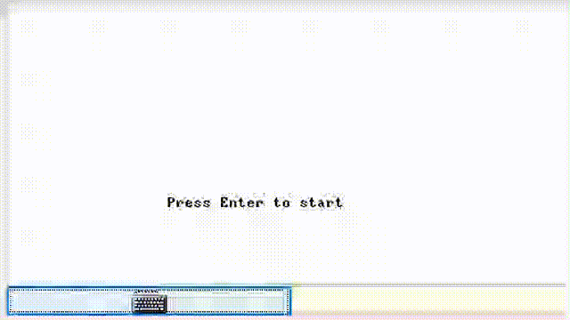

# The-Jumping-Man-Game
Nand2Tetris, project 09

The-Jumping-Man-Game is an atractive game where the goal is to to be able to survive on the falling bars and not fall to the bottom of the screen

The Jumping-Man game

Start the game: By pressing the ENTER key

During the game the sticks go down and the man has to jump between the sticks and be careful to do not fall, The speed of dropping the sticks varies depending on the stage, A jump will occur by pressing the SPACE key, only when the man is on one of the sticks, moves to the sides using the arrows The game ends at the end of Phase 3

End of the game: When winning / failing or by pressing the ESC key By pressing ENTER you can start a new game after the end of the current game

How to compile and run the code:

1. Use jackComplier to compile the files
2. Use VMEmulator to run complied VM code In the menu, go to File > Load Program and choose the directory JumperMan. Click yes in the confirmationg dialog In the toolbar, choose No animation in the Animate dropdown In the toolbar, click the double right arrows (3rd icon) Play the game!
